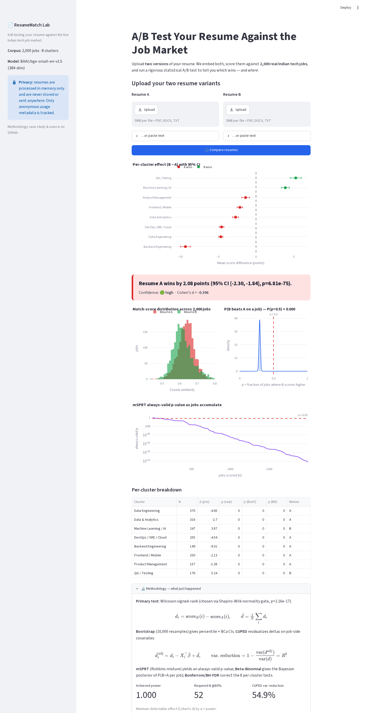

# 📄 ResumeMatch Lab

### A/B Testing Your Resume Against the Live Indian Tech Job Market

[](.github/workflows/ci.yml)
[](pyproject.toml)
[](LICENSE)
[](docs/methodology/case_study.md)



Upload **two versions of your resume**, and ResumeMatch Lab runs a rigorous statistical
**A/B test** to tell you which one matches more Indian tech jobs — by how much, with what
confidence, and *in which job clusters*. Not generic ATS keyword scoring: a real paired
experiment against **2,000 live job postings**, with frequentist, Bayesian, and sequential
inference.

> **Verdict example:** *"Resume A wins by 2.08 points (95% CI [1.84, 2.30], p < 0.001).
> But B wins **Machine Learning / AI** by +3.87 — send B for ML roles, A for infra."*

---

## ✨ What makes it different

| | Resume.io / Enhancv / Resume Worded | **ResumeMatch Lab** |
|---|---|---|
| Scoring basis | Generic ATS keyword rules | Semantic match vs **2,000 real jobs** |
| A/B comparison | ❌ | ✅ Rigorous paired experiment |
| Statistical rigor | ❌ | Bootstrap BCa, CUPED, mSPRT, Bayesian, FDR |
| Where you win | One global score | **Per-cluster** forest plot (8 job clusters) |
| Cost | Subscription | Free (₹0/month) |
| Privacy | Varies | Resumes never stored — in-memory only |

## 🔬 The statistical engine

Every analysis runs on the per-job paired delta `dᵢ = score_B(i) − score_A(i)`:

- **Frequentist** — paired t-test / Wilcoxon, auto-selected by a Shapiro-Wilk normality gate
- **Effect size & CI** — Cohen's *d*; 10,000-resample **bootstrap** with percentile + **BCa** intervals
- **Power** — required N, achieved power, and a minimum-detectable-effect (MDE) table
- **CUPED** — regression-based variance reduction on job-side covariates (~**55%** reduction in the demo run → effective N ×2.2)
- **mSPRT** — Robbins mixture sequential test → **always-valid p-values** (peek any time)
- **Bayesian** — Beta-Binomial posterior of `P(B beats A on a job)` with credible interval
- **Multiple comparisons** — per-cluster tests with **Bonferroni** + **Benjamini-Hochberg FDR**

📑 **Read the full [methodology case study](docs/methodology/case_study.md)** — the
publishable-quality writeup with derivations, design choices, and references.

## 🧬 Data: real jobs, shared embeddings

The 2,000-job corpus and its 384-dim embeddings are exported directly from the author's
sibling project **[JobAtlas](../JobAtlas)** — the same `BAAI/bge-small-en-v1.5` vectors,
the same job universe. This makes the two portfolio projects *consistent by construction*
and lets ResumeMatch ship a pre-embedded snapshot so it runs **fully offline**.

```
data/jobs_snapshot/jobs.parquet          2,000 jobs · 8 clusters (committed)
data/jobs_snapshot/cluster_labels.parquet
embeddings/jobs_cache.parquet            2,000 × 384 L2-normalized vectors
```

## 🚀 Quickstart

```bash
git clone https://github.com/<you>/resumematch-lab && cd resumematch-lab
python3.11 -m venv .venv && source .venv/bin/activate
pip install -r requirements.txt
streamlit run streamlit_app.py            # opens http://localhost:8501
```

Run the test suite and a real end-to-end demo:

```bash
pytest -q                                  # 25 tests
python scripts/smoke_demo.py               # full pipeline, real model
```

Rebuild the snapshot from JobAtlas's database (optional — it's committed):

```bash
python scripts/export_from_jobatlas.py
```

## 🗺️ Repo layout

```
core/        types, corpus loader, resume↔job scoring
parsers/     PDF (pdfplumber→pymupdf) / DOCX / TXT with quality flags
stats/       frequentist · power · cuped · sequential · bayesian · multiple_comparisons · engine
apps/frontend/  Streamlit app + Plotly charts + PDF report + PostHog analytics
analysis/r/  parallel implementation in R (Quarto) for cross-language validation
docs/        methodology case study · architecture · ADRs · business package
scripts/     export_from_jobatlas.py · smoke_demo.py
tests/       25 tests incl. real DOCX/PDF round-trips and end-to-end analysis
```

## 📊 Product analytics

Instrumented with **PostHog** (events, funnels, cohorts, a North-Star metric, and a
feature-flagged A/B test on the results-page layout — *we A/B test the A/B testing tool*).
Only anonymous metadata is sent; raw resume text never leaves the process. See
[docs/analytics.md](docs/analytics.md) and [docs/experiments/layout-v2.md](docs/experiments/layout-v2.md).

## 🔒 Privacy

Resumes are parsed and embedded **in memory only** and are **never written to disk** or
sent to any third party. PostHog receives event metadata (file type, character count,
effect size) — never resume content.

## 📦 Deployment

Free forever: **Streamlit Community Cloud** (point it at `streamlit_app.py`) +
GitHub + PostHog free tiers. Monthly cost: **₹0**.

## 📄 License

Code: **Apache-2.0**. Methodology document: **CC-BY-SA 4.0**.
