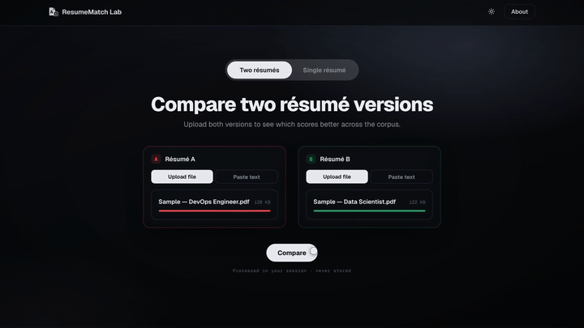
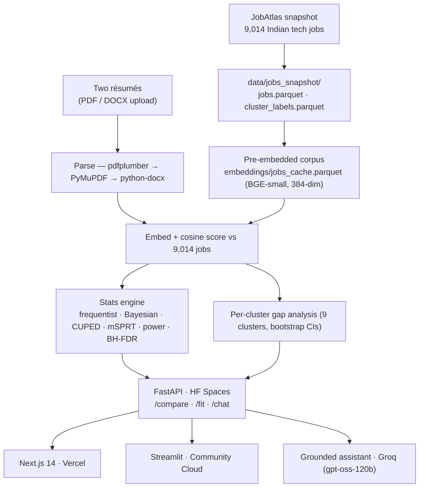

<div align="center">

# 📄 ResumeMatch Lab

### A/B test two résumé versions against the live Indian tech job market — which one wins, by how much, and where. Free to run, **₹0/month**.

[](https://github.com/ayushgupta07xx/ResumeMatchLab/actions/workflows/ci.yml)
[](LICENSE)
[](https://www.python.org/)
[](#by-the-numbers)
[](#by-the-numbers)
[](#by-the-numbers)
[](#free-forever-stack)

[](#tech-stack)
[](#tech-stack)
[](#tech-stack)
[](#tech-stack)
[](#tech-stack)
[](#tech-stack)
[](#tech-stack)
[](#tech-stack)
[](#tech-stack)

<br/>

[](https://youtu.be/zcAOFmiSpKs)

[](https://youtu.be/zcAOFmiSpKs)

🌐 **[Web app](https://resumematch-lab.vercel.app)** · 📊 **[Analyst app](https://resumematchlab.streamlit.app)** · 🛠 **[API](https://huggingface.co/spaces/ayushgupta7777/resumematch-api)**

</div>

---

Job seekers rewrite their résumé on gut feel — swap a summary, reorder skills, reword bullets — with no idea whether the new version actually matches *more* of the market, or fewer. Keyword-match tools score against a single posting and reward stuffing. Neither answers the real question: **across the jobs you're actually targeting, which version of your résumé wins, by how much, and for which kinds of roles?**

ResumeMatch Lab treats that as a designed experiment, not a vibe check. It embeds both résumé versions with a sentence-transformer and scores each against a fixed snapshot of **9,014 real Indian tech job postings**. Because every job is scored by *both* résumés, the data is naturally **paired** — the per-job score difference is the unit of analysis — and on that paired-delta vector it runs a deliberately over-complete battery of six statistical methods to say which version is stronger with real rigor, and breaks the verdict down across **9 job clusters** so you see *where* each version wins.

## Try it — three ways

|   | What | Link |
|---|---|---|
| 🌐 | **Web app** | The full product — upload two résumés, get the verdict, forest plot, and the assistant · **[resumematch-lab.vercel.app](https://resumematch-lab.vercel.app)** |
| 📊 | **Analyst app** | The Streamlit surface — the same engine, a statistician's view of every test · **[resumematchlab.streamlit.app](https://resumematchlab.streamlit.app)** |
| 🛠 | **Live API** | FastAPI service — `/compare`, `/fit`, `/chat` · **[…hf.space](https://huggingface.co/spaces/ayushgupta7777/resumematch-api)** |

## What it does

**Head-to-head (A/B).** Upload two résumé versions. Both are embedded and scored against all 9,014 jobs; because the scoring is paired, the per-job delta drives a full statistical battery that reports which version matches the market better, by how much, with what confidence — and a per-cluster breakdown showing which roles favor which version.

**Single-résumé market fit.** Score one résumé on its own — a percentile **Role Fit** against the corpus, with the skills it matches and the ones it's missing, cluster by cluster.

- **Semantic scoring** — `BAAI/bge-small-en-v1.5` (384-dim) sentence embeddings; cosine similarity of each résumé against every job, the corpus pre-embedded and cached so only the two uploaded résumés are embedded at request time.
- **Paired A/B battery (6 methods)** — frequentist (paired Wilcoxon / t), **Bayesian** posterior on the win rate, **CUPED** variance reduction, **mSPRT** always-valid sequential testing, **power / required-N**, and **Benjamini–Hochberg** correction across the per-cluster tests.
- **Per-cluster gap analysis** — the market segmented into 9 role clusters (k-means over job embeddings); each cluster's mean score gap with bootstrap confidence intervals, so the verdict is *where*, not just *whether*.
- **Résumé parsing** — triple fallback (`pdfplumber` → `PyMuPDF` → `python-docx`) so real-world PDFs and Word files parse reliably.
- **Downloadable report** — a `reportlab` PDF of the full result, generated on demand.
- **Grounded product assistant** — a **Groq**-served LLM (`openai/gpt-oss-120b`) that explains what each metric means and how to read the charts, aware of the specific run on screen, with a brief/detailed toggle — it explains the result, it doesn't invent numbers.

## By the numbers

Reference run — **DevOps Engineer (A)** vs **Data Scientist (B)** résumés, scored against all 9,014 jobs:

- **9,014** real Indian tech job postings, fixed snapshot, each scored by both résumés
- **Résumé A wins 71.4%** of jobs (B 28.6%) — a **−2.01 pt** mean gap, **95% CI [−2.12, −1.91]**, Wilcoxon **p → 0**, **Cohen's d −0.41** (*high confidence*)
- **CUPED** cut variance **40.0%** (**×1.67** effective sample size)
- **9 job clusters**; largest split — **DevOps/SRE/Cloud −8.36** (favors A), **Data Engineering +3.27** (favors B)
- **₹0/month** to run in production (free-tier OSS stack)

*Every figure above traces to the live committed snapshot and is reproducible from the app.*

## How it works


```mermaid
flowchart TB
    JA["JobAtlas snapshot<br/>9,014 Indian tech jobs"] --> SNAP["data/jobs_snapshot/<br/>jobs.parquet · cluster_labels.parquet"]
    SNAP --> EMB["Pre-embedded corpus<br/>embeddings/jobs_cache.parquet (BGE-small, 384-dim)"]
    R["Two résumés<br/>(PDF / DOCX upload)"] --> PARSE["Parse — pdfplumber → PyMuPDF → python-docx"]
    PARSE --> SCORE["Embed + cosine score vs 9,014 jobs"]
    EMB --> SCORE
    SCORE --> STATS["Stats engine<br/>frequentist · Bayesian · CUPED · mSPRT · power · BH-FDR"]
    SCORE --> GAPS["Per-cluster gap analysis (9 clusters, bootstrap CIs)"]
    STATS & GAPS --> API["FastAPI · HF Spaces<br/>/compare · /fit · /chat"]
    API --> NEXT["Next.js 14 · Vercel"]
    API --> ST["Streamlit · Community Cloud"]
    API --> LLM["Grounded assistant · Groq (gpt-oss-120b)"]
```

The 9,014-job corpus is a fixed snapshot exported from **[JobAtlas](https://github.com/ayushgupta07xx)** (this project's sibling job-market pipeline) and committed as parquet, pre-embedded so scoring is fast and deterministic. Uploaded résumés are parsed, embedded, and cosine-scored against every job; the paired deltas feed the stats engine and per-cluster gap analysis; a FastAPI service serves both the Next.js web app and the Streamlit analyst app. Full rationale is in [`docs/architecture.md`](docs/architecture.md), the method design in [`docs/methodology/`](docs/methodology/), and the decision trail in [`docs/decisions.md`](docs/decisions.md).

## The methodology

The core idea: scoring every job by *both* résumés makes the data **paired**, so the per-job difference `d_i = score_B(i) − score_A(i)` is the unit of analysis — a far tighter test than comparing two independent score distributions. On that delta vector the app runs an over-complete battery (frequentist + Bayesian + CUPED + sequential + power + multiple-comparison correction) precisely so the conclusion doesn't hinge on any single method's assumptions. The full write-up — design, assumptions, and limitations — is in [`docs/methodology/`](docs/methodology/), with supporting analysis in [`docs/experiments/`](docs/experiments/) and [`docs/analytics.md`](docs/analytics.md).

## Tech stack

| Layer | Tools |
|---|---|
| Embeddings | `sentence-transformers` — `BAAI/bge-small-en-v1.5` (384-dim), CPU-only PyTorch |
| Statistics | SciPy · statsmodels · scikit-learn · pingouin (frequentist, Bayesian, CUPED, mSPRT, power, BH-FDR, k-means clusters) |
| Parsing | pdfplumber · PyMuPDF · python-docx (triple fallback) |
| Data | pandas · pyarrow · committed parquet snapshot (corpus + cached embeddings + cluster labels) |
| Serving | FastAPI · Uvicorn (Hugging Face Spaces, Docker) |
| Frontend | Next.js 14 (Vercel, Tailwind) · Streamlit (Community Cloud) |
| Reports / viz | reportlab (PDF) · Plotly · Matplotlib |
| Assistant | Groq LLM — `openai/gpt-oss-120b`, grounded to the on-screen run |
| Typed models | Pydantic |
| Infra / CI | Docker · GitHub Actions (ruff · mypy · pytest) |

## Free-forever stack

Production runs entirely on free tiers — Vercel (web), Streamlit Community Cloud (analyst app), Hugging Face Spaces (API). The corpus and embeddings ship in-repo as parquet, so there's no database to host. **Monthly cost in production: ₹0.**

## Local setup

Prerequisites: Python 3.11.

```bash
git clone https://github.com/ayushgupta07xx/ResumeMatchLab.git
cd ResumeMatchLab
python -m venv .venv && source .venv/bin/activate
pip install -r requirements.txt
streamlit run streamlit_app.py          # analyst app
# or serve the API:  uvicorn apps.api.main:app --reload
```

## Repo layout

```
core/            scoring, clustering, per-cluster gaps, fit, data loading
stats/           frequentist · bayesian · cuped · sequential · power · multiple_comparisons · engine
apps/
  api/           FastAPI service (/compare, /fit, /chat)
  web/           Next.js 14 frontend (Vercel)
  frontend/      Streamlit analyst app
data/jobs_snapshot/   jobs.parquet · cluster_labels.parquet (fixed corpus)
embeddings/           jobs_cache.parquet (pre-embedded corpus)
docs/
  architecture.md · decisions.md (ADRs) · methodology/ · experiments/ · analytics.md
  business/       personas, user stories, SWOT, market sizing, competitive analysis
  images/         product + supporting visuals
```

## Honest limitations

- **Fixed corpus snapshot.** The 9,014 jobs are a point-in-time export from JobAtlas, not a live feed — results reflect that snapshot, not today's market.
- **Semantic ≠ ATS.** Scores are cosine similarity of embeddings, a measure of *content* match to real postings — not a simulation of any specific company's applicant-tracking system.
- **Reference run is illustrative.** The headline numbers come from one A/B (DevOps vs Data Scientist résumés); your own uploads produce your own verdict.

## License

Code under **Apache 2.0** — see [`LICENSE`](LICENSE).

---

<div align="center">

Built by **Ayush Gupta** · [GitHub](https://github.com/ayushgupta07xx) · [LinkedIn](https://www.linkedin.com/in/ayush-gupta-544a803a2)

<sub>Music in the demo: <strong>"Semantics" by tubebackr</strong> — <a href="https://www.audiolibrary.com.co/tubebackr/semantics">Audio Library</a> · promoted by <a href="https://links.al/youtube">Audio Library</a></sub>

</div>
