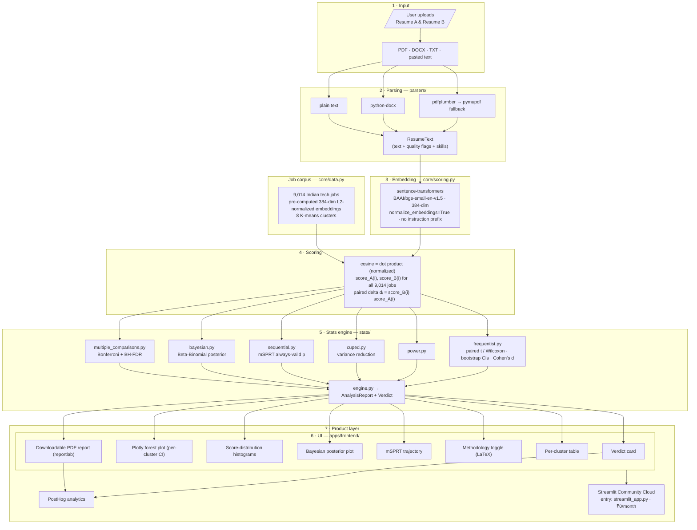
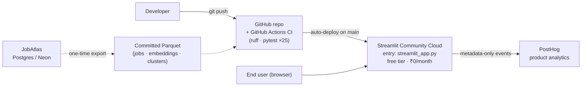

# ResumeMatch Lab — Architecture

ResumeMatch Lab is a deployed Streamlit web app that turns a casual question — *"Which version of my resume is better?"* — into a statistically rigorous answer. A user uploads two resume variants (**A** and **B**); the app embeds each one, scores it against a fixed corpus of 9,014 real Indian tech jobs, computes paired per-job deltas, and runs a full experimentation stats stack (frequentist, sequential, Bayesian, CUPED, multiple-comparison correction) to deliver a defensible verdict with confidence intervals.

The product is, in effect, an A/B testing platform for resumes — and it is built using the same statistical machinery a growth team would use to evaluate a feature flag.

---

## System overview (Mermaid)

---

## Components

| Layer | Module / Path | Responsibility |
|-------|---------------|----------------|
| Input & parsing | `parsers/` | Accept PDF, DOCX, TXT, or pasted text. PDF is parsed with **pdfplumber**, falling back to **pymupdf** on failure; DOCX via **python-docx**; TXT and pasted text directly. Emits a `ResumeText` carrying the raw text, **quality flags** (e.g. low-text-extraction warnings), and **extracted skills**. |
| Embedding | `core/scoring.py` | Embeds both resumes with sentence-transformers **`BAAI/bge-small-en-v1.5`** (384-dim) using `normalize_embeddings=True` and **no instruction prefix** — byte-for-byte identical to how the job corpus was embedded, so resume and job vectors share one geometry. |
| Job corpus | `core/data.py` | Loads the fixed corpus of **9,014 real Indian tech jobs** with pre-computed 384-dim **L2-normalized** embeddings and **8 K-means cluster** labels from committed Parquet files. |
| Scoring | `core/scoring.py` | Computes cosine similarity (= dot product, since all vectors are normalized) of each resume against all 9,014 jobs, then forms **paired deltas** `dᵢ = score_B(i) − score_A(i)`. |
| Frequentist stats | `stats/frequentist.py` | **Paired t-test** or **Wilcoxon signed-rank**, auto-selected by a **Shapiro-Wilk** normality check; **bootstrap** confidence intervals (percentile **and** BCa); **Cohen's d** effect size. |
| Power | `stats/power.py` | Power / sensitivity analysis for the paired design. |
| CUPED | `stats/cuped.py` | **Variance reduction** using job-side covariates: cluster one-hot encoding + job-description length. |
| Sequential | `stats/sequential.py` | **mSPRT** with a Robbins mixture, yielding an **always-valid p-value** that permits continuous monitoring. |
| Bayesian | `stats/bayesian.py` | **Beta-Binomial** posterior over the probability that B beats A. |
| Multiple comparisons | `stats/multiple_comparisons.py` | Per-cluster correction via **Bonferroni** and **Benjamini-Hochberg FDR**. |
| Orchestration | `stats/engine.py` | Runs all stats modules and assembles a single **`AnalysisReport`** plus a human-readable **`Verdict`**. |
| UI | `apps/frontend/app.py` + `components/` | Renders the verdict card, Plotly forest plot, score histograms, Bayesian posterior, mSPRT trajectory, LaTeX methodology toggle, per-cluster table, and a reportlab PDF export. Emits PostHog events. |
| Deployment entry | `streamlit_app.py` | Entry point for Streamlit Community Cloud. |

---

## The 8 job clusters

The corpus is partitioned by K-means into eight role families, which drive the per-cluster forest plot and the multiple-comparison correction:

| # | Cluster |
|---|---------|
| 1 | Data Engineering |
| 2 | Data & Analytics |
| 3 | Machine Learning / AI |
| 4 | DevOps / SRE / Cloud |
| 5 | Backend Engineering |
| 6 | Frontend / Mobile |
| 7 | Product Management |
| 8 | Design / UX |

---

## Data flow

1. **Upload** — the user provides Resume A and Resume B in any supported format.
2. **Parse** — each file becomes a `ResumeText` with quality flags and extracted skills. Quality flags surface to the UI as parse-quality warnings.
3. **Embed** — both resumes are embedded into the same 384-dim normalized space as the job corpus.
4. **Score** — each resume is scored against all 9,014 jobs; pairing the two score vectors job-by-job yields the delta vector `d`.
5. **Analyze** — `stats/engine.py` runs the frequentist, power, CUPED, sequential, Bayesian, and multiple-comparison modules over `d` (and per cluster), producing an `AnalysisReport` and a `Verdict`.
6. **Render** — the frontend visualizes the report and lets the user download a PDF and trigger product-analytics events.

The paired design is the crux: because every job is scored by **both** resumes, the per-job delta cancels job-specific difficulty, making the comparison far more sensitive than comparing two independent score distributions.

---

## Tech stack

| Concern | Choice |
|---------|--------|
| UI framework | Streamlit |
| Embedding model | sentence-transformers, `BAAI/bge-small-en-v1.5` (384-dim) |
| PDF parsing | pdfplumber → pymupdf (fallback) |
| DOCX parsing | python-docx |
| Numerics & stats | NumPy / SciPy (t-test, Wilcoxon, Shapiro-Wilk, bootstrap) |
| Data storage | Committed Parquet snapshots (no live DB at runtime) |
| Charts | Plotly |
| PDF report export | reportlab |
| Product analytics | PostHog |
| Hosting | Streamlit Community Cloud (free tier) |
| CI | GitHub Actions — ruff (lint) + pytest (25 tests) |
| Tests | pytest (25 tests) |

---

## Data lineage from JobAtlas

The 9,014-job corpus is **not** generated inside ResumeMatch Lab. It is derived from the sibling project **JobAtlas**, which maintains the live job dataset and embeddings in a Postgres database on **Neon**. For ResumeMatch Lab, that data is exported into committed Parquet snapshots so the app has **no runtime database dependency** and runs at ₹0:

| Artifact | Path | Contents |
|----------|------|----------|
| Job snapshot | `data/jobs_snapshot/jobs.parquet` | Job metadata for the 9,014 jobs |
| Embeddings cache | `embeddings/jobs_cache.parquet` | Pre-computed 384-dim L2-normalized job embeddings |
| Cluster labels | `cluster_labels.parquet` | K-means cluster assignment per job |

Because the embeddings travel with the repo, the only model invoked at runtime is the resume encoder — and it must reproduce JobAtlas's embedding recipe exactly (`bge-small-en-v1.5`, normalized, no instruction prefix) for the cosine scores to be meaningful.

---

## Deployment topology

- **GitHub** hosts the source and runs CI (ruff + pytest) on every push.
- **Streamlit Community Cloud** auto-deploys from `main` via `streamlit_app.py` on the free tier — total infra cost **₹0/month**.
- **PostHog** receives metadata-only product-analytics events (no resume text ever leaves the app).
- **JobAtlas → Parquet** is a one-time/offline export, not a live connection; the deployed app reads only the committed Parquet files.
